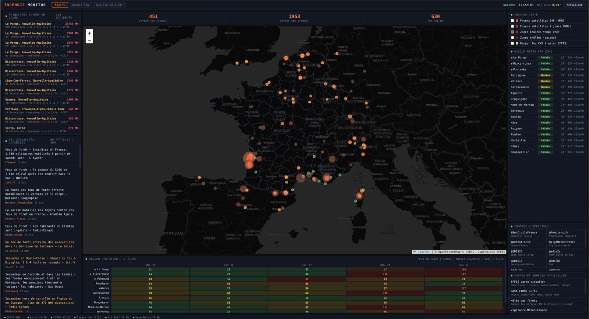
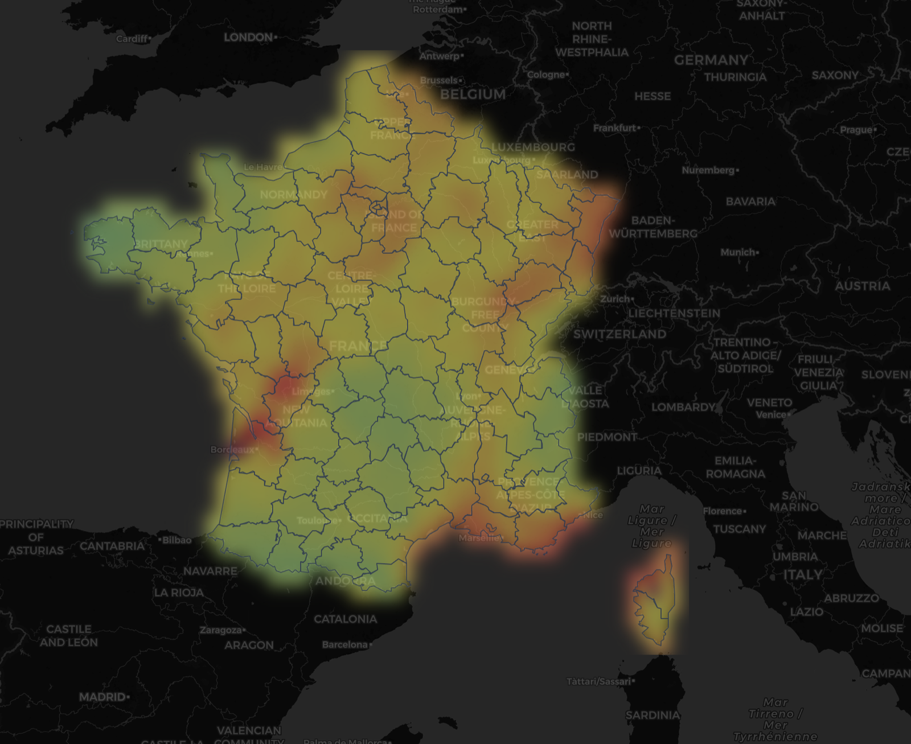

# Incendie monitor - France

Dashboard temps réel de suivi des feux de forêt en France : détections satellites, danger météo, qualité de l'air. Frontend Leaflet en un seul fichier `index.html`, backend de cache FastAPI optionnel.



## Modes d'affichage

- **Foyers** : points chauds satellites VIIRS (NASA FIRMS) regroupés en incidents, zones brûlées EFFIS, panneau des principaux foyers en cours triés par puissance radiative.
- **Risque feu** : indice de danger météo (Chandler ajusté vent/pluie) calculé sur une grille d'environ 25 km couvrant la métropole, lissé en dégradé continu, avec sélecteur de jour (aujourd'hui à J+4) et grille 5 jours pour les zones prioritaires (feux en cours d'abord).
- **Qualité de l'air** : indice européen EAQI sur la même grille fine (modèle CAMS ~11 km), avec classement par département (PM2.5, PM10, ozone).



C'est un indicateur simplifié : se référer à la [météo des forêts](https://meteofrance.com/meteo-des-forets) de Météo-France pour le danger officiel.

## Utilisation

### Mode direct, sans installation

Ouvrir `index.html` dans un navigateur. Les données passent alors par des proxys CORS publics (moins fiable), et les grilles fines sont remplacées par un affichage départemental.

### Mode backend (recommandé)

```bash
python3 -m venv .venv && .venv/bin/pip install -r requirements.txt
FIRMS_KEY=xxxx .venv/bin/uvicorn server:app --port 8081
# puis http://localhost:8081
```

Le frontend détecte le backend automatiquement (badge vert « backend »). La clé FIRMS est lue depuis la variable d'environnement `FIRMS_KEY`, ou à défaut depuis un fichier `config.js` non versionné (`window.FIRMS_KEY = '...'`).

Le backend met tout en cache et protège les API amont :

| Donnée | Cache | Mécanisme |
|---|---|---|
| Tuiles EFFIS (WMS) | disque, 3 h | validation stricte des paramètres, purge > 24 h |
| Actualités (Google News RSS) | 5 min | service de l'ancien contenu si l'amont est indisponible |
| FIRMS | 10 min | |
| Météo zones | 15 min | coordonnées bornées à la France |
| Grille risque feu 5 jours | 2 h | stale-while-revalidate, persistée sur disque |
| Grille qualité de l'air | 1 h | stale-while-revalidate, persistée sur disque |

Une seule requête amont par TTL quel que soit le nombre de visiteurs. Les fetchs amont déclenchés par le public sont en plus plafonnés globalement (60/min) : au-delà, le serveur sert le cache ou du périmé, jamais l'amont. Les IP listées dans `TRUSTED_IPS` (et localhost) ne sont pas limitées.

### Déploiement VPS (nginx)

```bash
./deploy/deploy.sh
```

Le script rsync le projet, installe l'environnement Python, pose le service systemd (`deploy/incendie-monitor.service`, durci) et redémarre. Installer ensuite `deploy/nginx.conf` comme site (voir les commentaires du fichier), puis `sudo nginx -t && sudo systemctl reload nginx`.

## Sources de données

| Source | Données | Accès |
|---|---|---|
| Copernicus EFFIS (WMS) | Foyers satellites 24h/7j, zones brûlées, indice FWI | Libre, sans clé |
| NASA FIRMS | Foyers cliquables, statistiques, incidents en cours | Clé MAP_KEY gratuite |
| Open-Meteo | Météo temps réel, grilles risque feu et qualité de l'air | Libre, sans clé |
| BigDataCloud | Géocodage inverse des principaux foyers | Libre, sans clé |
| Google News RSS | Fil d'actualités incendies 48h | Via le backend (ou proxy CORS en mode direct) |
| Comptes X officiels | Sécurité civile, SDIS, préfectures | Liens directs |

## Notes

- Le regroupement des détections satellites en incidents se fait sur une grille d'environ 10 km, trié par puissance radiative cumulée, zoom au clic.
- Les rendus lissés (risque feu, air) sont dessinés en canvas projeté Mercator puis posés en `imageOverlay` : la bascule entre jours est instantanée, les images étant pré-calculées.
- La clé FIRMS saisie dans l'interface est stockée en localStorage, uniquement dans le navigateur.
